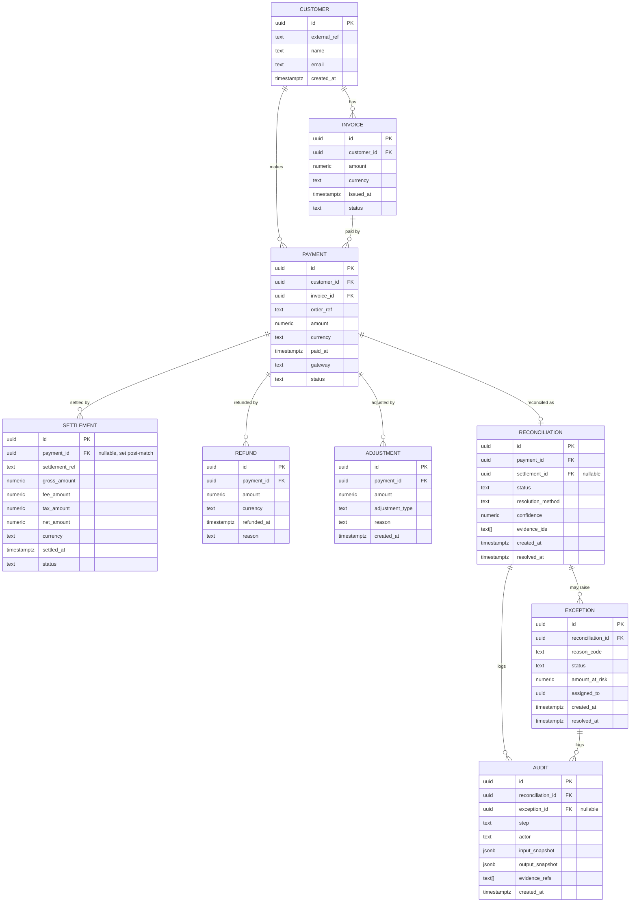

# AI Finance Controller — Track 04: Payment + Settlement Reconciliation with AI-Powered Exception Investigation

**Version:** 1.0
**Authors:** Product Management (AI Finance Controller Track 04)
**Date:** 2026-09-01
**Status:** Delivery-ready draft for engineering, data, and QA implementation

## Revision History

| Version | Date | Author | Summary |
|---|---|---|---|
| 0.1 | — | Product | Initial outline from project brief |
| 1.0 | 2026-09-01 | Product | Full PRD covering Steps 6–17: candidate generation through final demo |

## Assumptions

These assumptions are stated up front because several downstream design decisions (thresholds, indices, timeline estimates) depend on them. Revisit and update this section if any assumption changes.

- **Data volumes:** Development/test at 500–5,000 records; scale/stress testing target is 100,000 payment records with a comparable number of settlements. Peak ingestion assumed at 500 payments/minute during stress tests.
- **Team capacity:** One backend engineer, one data/ML engineer, one frontend engineer, one QA engineer, and a product manager, each at roughly 70% allocation to this track for the remaining timeline. Estimates in Section 23 assume this staffing; adjust proportionally if capacity differs.
- **Currency:** Single base currency (INR) for the majority of synthetic records, with a minority (~10%) multi-currency records to exercise FX conversion logic. FX rates are static per synthetic-data snapshot (no live FX feed).
- **AI provider:** OpenAI API (GPT-4-class model) accessed via a backend-mediated tool-calling interface; no direct model access from frontend or from the reconciliation engine's core matching logic.
- **Environment:** Supabase PostgreSQL is the system of record; Row Level Security (RLS) is enabled on all entity tables; FastAPI services run in Docker containers; deployment target is a single-region setup for this track (no multi-region requirement).
- **Ground truth isolation:** Ground truth labels exist in a separate schema/table set (`eval.*`) that is not queryable by any service role used by reconciliation, candidate generation, or the AI investigator. Only the evaluation service's role can read it.
- **Demo:** Final demo is a 5-minute walkthrough (referred to informally as the "Razorpay demo flow") covering ingestion → candidate generation → deterministic match → AI investigation → human review → metrics dashboard.

---

## 2. Executive Summary

Finance operations teams reconciling payments against settlements across gateways, banks, and internal ledgers spend disproportionate manual effort chasing a long tail of exceptions — fees, taxes, partial settlements, duplicates, and mismatches — that don't resolve via simple exact-match logic, while still needing every resolution to be explainable and auditable for compliance. The AI Finance Controller (Track 04) closes this loop end-to-end on a controlled synthetic dataset: deterministic rules resolve the straightforward majority of transactions with full auditability, and an AI investigator — restricted to tool-mediated, evidence-gated reasoning with no direct database access — resolves the ambiguous remainder or escalates to human review when evidence is insufficient, all measured against held-out ground truth that the reconciliation engine itself can never see.

Success is defined by a measurable, reproducible pipeline: high deterministic match rate on unambiguous scenarios, high AI-investigation yield with low false-positive/false-negative rates on ambiguous scenarios, a bounded human-review queue, full audit trail coverage for every state transition, and demonstrated throughput at 100k-record scale — all presented in a live dashboard for the final demo.

---

## 3. Goals & Success Metrics

| # | Goal | Metric | Numeric Target | Measurement Method |
|---|---|---|---|---|
| G1 | Resolve unambiguous cases deterministically, without AI | Deterministic Match Rate | ≥ 70% of EXACT_MATCH/FEE/TAX/REFUND/PARTIAL_SETTLEMENT scenarios resolved without invoking AI | Count `Reconciliation.resolution_method = 'DETERMINISTIC'` / total eligible |
| G2 | AI investigator resolves ambiguous cases correctly | AI Investigation Accuracy | ≥ 90% verdict-correct on scenarios routed to AI, vs. ground truth | Evaluation harness (Section 17) |
| G3 | Keep false auto-resolutions low | False-Positive Rate (auto-resolve) | ≤ 2% of auto-resolved cases incorrect vs. ground truth | Evaluation harness |
| G4 | Avoid missed exceptions | False-Negative Rate | ≤ 3% of true exceptions marked resolved | Evaluation harness |
| G5 | Bound human workload | Human-Review Queue Rate | ≤ 15% of total transaction volume routed to human review | `Exception.status = 'NEEDS_HUMAN_REVIEW'` / total |
| G6 | Full explainability | Audit Trail Coverage | 100% of state transitions have an immutable audit record with evidence references | Audit table row count vs. state-transition event count |
| G7 | Demonstrate scale | Throughput | ≥ 1,000 transactions/minute sustained candidate-generation + deterministic pass at 100k scale | Stress test harness (Section 20) |
| G8 | Bound AI latency/cost | AI Investigator Latency | p95 ≤ 8s per case; cost ≤ $0.02/case at target model pricing | Instrumented AI tool-call logs |
| G9 | Ground truth isolation | Zero leakage | 0 references to `eval.*` schema from non-evaluation service roles | Static analysis + RLS policy audit (Section 19) |

---

## 4. Key Insights & Architectural Principles

1. **Deterministic-first.** Every transaction pair is first evaluated against an ordered set of deterministic rules (Section 11). Only transactions that fail *all* deterministic rules — or partially match with unexplained residuals — are escalated to the AI investigator. This bounds AI cost/latency and keeps the majority of decisions fully explainable by rule ID rather than model reasoning.
2. **Evidence-gating.** The AI investigator is a reasoning and evidence-retrieval agent, not a decision-maker with unchecked authority. Its structured verdict is only applied to reconciliation state after backend evidence validation (Section 13) independently re-derives and checks the arithmetic, ownership, and temporal claims behind the verdict. An unvalidated or partially validated verdict is downgraded to `NEEDS_HUMAN_REVIEW`.
3. **Tool-mediated AI, no direct DB access.** The AI investigator never receives raw DB credentials or executes SQL. It calls a fixed set of read-only tools (Section 12) that return scoped, minimal, redacted views of records. This bounds the blast radius of prompt injection or hallucinated queries and gives a clean audit boundary.
4. **Confidence routing, not binary AI/no-AI.** AI verdicts carry a confidence score; routing to auto-resolve, human review, or exception/hold is threshold-driven and independently tunable from evaluation results (Section 14), decoupling model behavior from business risk tolerance.
5. **Auditability as a first-class entity, not a log side-effect.** `Audit` is a core entity (Section 8) with immutable, evidence-linked rows for every processing step — not an afterthought log line — because financial reconciliation decisions must be reconstructable and defensible after the fact.
6. **Strict ground-truth isolation.** Ground truth exists solely to power the evaluation service. No reconciliation, candidate-generation, or AI-investigator code path may read it; this is enforced structurally via separate schemas and RLS roles (Section 19), not just by convention.

---

## 5. Scope

### In-Scope
- Payment ↔ Settlement reconciliation for a single synthetic dataset spanning the 14 defined scenario types.
- Candidate generation, deterministic rule engine, AI investigator, evidence validation, confidence routing, human-review workflow, audit trail, evaluation harness, dashboard, and stress testing (Steps 6–17).
- Refunds and Adjustments as first-class entities affecting reconciliation math.
- Multi-settlement aggregation (one payment settled across multiple settlement records) and partial settlement handling.
- Basic multi-currency support with static FX conversion for the synthetic dataset.
- RLS-based access control and an immutable audit trail.
- A demo-ready dashboard with key metrics panels.

### Out-of-Scope
- Live payment gateway integrations (Razorpay, Stripe, etc.) — dataset is synthetic and controlled.
- Real-time/streaming ingestion (batch/near-real-time processing is sufficient).
- Dynamic/live FX rate feeds.
- Multi-region deployment, DR/failover architecture.
- General ledger / accounting system integration (journal entries, GL posting) beyond internal `Reconciliation`/`Adjustment` records.
- Fraud detection or AML screening.
- Non-English locales / i18n for the UI.
- Fine-tuning or hosting a custom LLM (OpenAI API only).

---

## 6. User Personas & Roles

| Persona | Role Summary | Primary Needs |
|---|---|---|
| **Finance Analyst** | Reviews daily reconciliation summaries and exception counts | High-level dashboards, drill-down into exception categories, exportable reports |
| **Reconciliation Specialist** | Works the human-review queue; makes final calls on `NEEDS_HUMAN_REVIEW` cases | Case detail view with full evidence trail, side-by-side payment/settlement data, one-click resolve/escalate actions |
| **Ops Engineer** | Operates and monitors the pipeline (candidate gen, AI investigator, throughput) | System health dashboards, job queues, retry controls, alerting |
| **Data Engineer** | Owns synthetic data generation, schema migrations, indexing | Access to data generation configs, schema docs, index/perf metrics |
| **Auditor** | Reviews historical decisions for compliance | Read-only access to immutable audit trail, full evidence chain per reconciliation, export to CSV/PDF |

Role-to-access mapping is enforced via Supabase RLS policies (Section 19); each persona maps to a distinct Postgres role/claim.

---

## 7. User Journeys & UX Requirements

### 7.1 Normal Matched Flow (Deterministic)
1. Payment and Settlement ingested → candidate generation surfaces 5–20 candidate settlements per payment.
2. Deterministic rule engine finds an exact/keyed match → `Reconciliation.status = MATCHED`, `resolution_method = DETERMINISTIC`.
3. Audit record written with rule ID and matched fields.
4. Appears in dashboard as "Auto-Matched" with no analyst action required.

**UX requirement:** Reconciliation list view defaults to filtering out `MATCHED` rows older than the current session; matched rows are collapsible/expandable to show the rule trace without navigating away.

### 7.2 AI-Investigated Flow
1. Deterministic rules find a candidate but with an unexplained residual (e.g., amount off by an unrecognized delta) → `status = AMBIGUOUS`.
2. AI investigator is invoked with the payment, top candidates, and tool access.
3. AI returns a structured verdict with evidence IDs.
4. Backend evidence validation independently checks the verdict.
5. Confidence router applies thresholds → `RESOLVED_AFTER_INVESTIGATION` (auto), `NEEDS_HUMAN_REVIEW`, or `EXCEPTION`.
6. Audit record captures the full AI reasoning input/output plus validation results.

**UX requirement:** Case detail view shows a timeline: Candidate Generation → Deterministic Check (failed, reason) → AI Investigation (verdict, confidence, evidence chips) → Validation (pass/fail per check) → Final Status. Evidence chips are clickable to reveal the underlying evidence record.

### 7.3 Exception Flow
1. No deterministic match, AI confidence below hold threshold, or evidence validation fails.
2. `Exception` record created with reason code and full context snapshot.
3. Surfaced in the Exception queue, sorted by age and amount at risk.

**UX requirement:** Exception queue is sortable/filterable by scenario-type-adjacent reason code, amount, and age; bulk-assign to a specialist is supported.

### 7.4 Human-Review Flow
1. Case with mid-range AI confidence lands in the review queue.
2. Reconciliation Specialist opens case detail, sees AI's proposed verdict + evidence + validation results.
3. Specialist accepts, overrides, or requests more evidence (triggers a follow-up AI tool call, e.g. `search_related_transactions`).
4. Decision recorded with specialist identity, timestamp, and rationale → immutable audit entry.

**UX requirement:** Accept/Override is a two-step confirm for override (to avoid accidental clicks affecting financial state); overrides require a free-text rationale, stored in the audit trail.

---

## 8. Data Model

### 8.1 ER Diagram (Mermaid)



### 8.2 Table Schemas

```sql
-- Customers
CREATE TABLE customer (
    id UUID PRIMARY KEY DEFAULT gen_random_uuid(),
    external_ref TEXT UNIQUE NOT NULL,
    name TEXT NOT NULL,
    email TEXT,
    created_at TIMESTAMPTZ NOT NULL DEFAULT now()
);

-- Invoices
CREATE TABLE invoice (
    id UUID PRIMARY KEY DEFAULT gen_random_uuid(),
    customer_id UUID NOT NULL REFERENCES customer(id),
    amount NUMERIC(18,2) NOT NULL,
    currency CHAR(3) NOT NULL DEFAULT 'INR',
    issued_at TIMESTAMPTZ NOT NULL,
    status TEXT NOT NULL CHECK (status IN ('OPEN','PAID','PARTIAL','VOID'))
);
CREATE INDEX idx_invoice_customer ON invoice(customer_id);

-- Payments
CREATE TABLE payment (
    id UUID PRIMARY KEY DEFAULT gen_random_uuid(),
    customer_id UUID NOT NULL REFERENCES customer(id),
    invoice_id UUID REFERENCES invoice(id),
    order_ref TEXT,
    amount NUMERIC(18,2) NOT NULL,
    currency CHAR(3) NOT NULL DEFAULT 'INR',
    paid_at TIMESTAMPTZ NOT NULL,
    gateway TEXT NOT NULL,
    status TEXT NOT NULL DEFAULT 'CAPTURED'
);
CREATE INDEX idx_payment_customer ON payment(customer_id);
CREATE INDEX idx_payment_order_ref ON payment(order_ref);
CREATE INDEX idx_payment_amount ON payment(amount);
CREATE INDEX idx_payment_paid_at ON payment(paid_at);
CREATE INDEX idx_payment_currency_amount_date ON payment(currency, amount, paid_at);

-- Settlements
CREATE TABLE settlement (
    id UUID PRIMARY KEY DEFAULT gen_random_uuid(),
    payment_id UUID REFERENCES payment(id), -- nullable until matched
    settlement_ref TEXT,
    gross_amount NUMERIC(18,2) NOT NULL,
    fee_amount NUMERIC(18,2) NOT NULL DEFAULT 0,
    tax_amount NUMERIC(18,2) NOT NULL DEFAULT 0,
    net_amount NUMERIC(18,2) NOT NULL,
    currency CHAR(3) NOT NULL DEFAULT 'INR',
    settled_at TIMESTAMPTZ NOT NULL,
    status TEXT NOT NULL DEFAULT 'RECEIVED'
);
CREATE INDEX idx_settlement_payment ON settlement(payment_id);
CREATE INDEX idx_settlement_ref ON settlement(settlement_ref);
CREATE INDEX idx_settlement_currency_amount_date ON settlement(currency, net_amount, settled_at);

-- Refunds
CREATE TABLE refund (
    id UUID PRIMARY KEY DEFAULT gen_random_uuid(),
    payment_id UUID NOT NULL REFERENCES payment(id),
    amount NUMERIC(18,2) NOT NULL,
    currency CHAR(3) NOT NULL DEFAULT 'INR',
    refunded_at TIMESTAMPTZ NOT NULL,
    reason TEXT
);
CREATE INDEX idx_refund_payment ON refund(payment_id);

-- Adjustments
CREATE TABLE adjustment (
    id UUID PRIMARY KEY DEFAULT gen_random_uuid(),
    payment_id UUID NOT NULL REFERENCES payment(id),
    amount NUMERIC(18,2) NOT NULL,
    adjustment_type TEXT NOT NULL, -- e.g. CHARGEBACK, MANUAL_CORRECTION
    reason TEXT,
    created_at TIMESTAMPTZ NOT NULL DEFAULT now()
);
CREATE INDEX idx_adjustment_payment ON adjustment(payment_id);

-- Reconciliation
CREATE TABLE reconciliation (
    id UUID PRIMARY KEY DEFAULT gen_random_uuid(),
    payment_id UUID NOT NULL REFERENCES payment(id) UNIQUE,
    settlement_id UUID REFERENCES settlement(id),
    status TEXT NOT NULL CHECK (status IN ('MATCHED','AMBIGUOUS','RESOLVED_AFTER_INVESTIGATION','NEEDS_HUMAN_REVIEW','EXCEPTION')),
    resolution_method TEXT CHECK (resolution_method IN ('DETERMINISTIC','AI_INVESTIGATION','HUMAN')),
    confidence NUMERIC(4,3),
    evidence_ids TEXT[],
    created_at TIMESTAMPTZ NOT NULL DEFAULT now(),
    resolved_at TIMESTAMPTZ
);
CREATE INDEX idx_reconciliation_status ON reconciliation(status);

-- Exceptions
CREATE TABLE exception (
    id UUID PRIMARY KEY DEFAULT gen_random_uuid(),
    reconciliation_id UUID NOT NULL REFERENCES reconciliation(id),
    reason_code TEXT NOT NULL,
    status TEXT NOT NULL DEFAULT 'OPEN' CHECK (status IN ('OPEN','NEEDS_HUMAN_REVIEW','RESOLVED','CLOSED')),
    amount_at_risk NUMERIC(18,2),
    assigned_to UUID,
    created_at TIMESTAMPTZ NOT NULL DEFAULT now(),
    resolved_at TIMESTAMPTZ
);
CREATE INDEX idx_exception_status ON exception(status);

-- Audit (immutable — no UPDATE/DELETE grants; append-only)
CREATE TABLE audit (
    id UUID PRIMARY KEY DEFAULT gen_random_uuid(),
    reconciliation_id UUID REFERENCES reconciliation(id),
    exception_id UUID REFERENCES exception(id),
    step TEXT NOT NULL, -- CANDIDATE_GEN, DETERMINISTIC_CHECK, AI_INVESTIGATION, EVIDENCE_VALIDATION, CONFIDENCE_ROUTING, HUMAN_REVIEW
    actor TEXT NOT NULL, -- 'system:candidate-gen', 'system:ai-investigator', 'user:<uuid>'
    input_snapshot JSONB NOT NULL,
    output_snapshot JSONB NOT NULL,
    evidence_refs TEXT[],
    created_at TIMESTAMPTZ NOT NULL DEFAULT now()
);
CREATE INDEX idx_audit_reconciliation ON audit(reconciliation_id);
CREATE INDEX idx_audit_step_created ON audit(step, created_at);
```

### 8.3 RLS Notes (Supabase)
- Enable RLS on every table above (`ALTER TABLE <t> ENABLE ROW LEVEL SECURITY;`).
- Service roles: `svc_candidate_gen`, `svc_deterministic`, `svc_ai_investigator`, `svc_evaluation`, `svc_api` (read/write scoped per role), plus user-facing roles `role_finance_analyst`, `role_recon_specialist`, `role_ops_engineer`, `role_data_engineer`, `role_auditor`.
- Only `svc_evaluation` has any grant on `eval.*` schema (ground truth). All other roles get zero grants there, enforced at both the RLS-policy and schema-grant level (belt and suspenders — see Section 19 for the full policy set).
- `audit` table: `INSERT`-only grants for service roles; no `UPDATE`/`DELETE` grants for any role, including admin service accounts, to preserve immutability; corrections are new audit rows referencing the original.

---

## 9. Synthetic Data Plan

### 9.1 Scenario Distribution

| Scenario | 500-record target | 100k-record target | Notes |
|---|---|---|---|
| EXACT_MATCH | 35% (175) | 35% (35,000) | Deterministic, trivial |
| FEE | 10% (50) | 10% (10,000) | net = gross − fee |
| TAX | 6% (30) | 6% (6,000) | net = gross − tax |
| REFUND | 6% (30) | 6% (6,000) | partial/full refund reduces expected settlement |
| PARTIAL_SETTLEMENT | 6% (30) | 6% (6,000) | settlement < payment amount, remainder pending |
| DUPLICATE | 4% (20) | 4% (4,000) | two settlements for one payment, one must be flagged |
| MISSING_SETTLEMENT | 6% (30) | 6% (6,000) | payment exists, no settlement yet |
| MISSING_PAYMENT | 3% (15) | 3% (3,000) | settlement exists, no matching payment (orphan) |
| DATE_MISMATCH | 5% (25) | 5% (5,000) | settlement date outside normal window |
| CUSTOMER_MISMATCH | 3% (15) | 3% (3,000) | settlement linked to wrong customer reference |
| AMOUNT_DISCREPANCY | 6% (30) | 6% (6,000) | unexplained delta, not fee/tax/refund |
| MULTIPLE_SETTLEMENTS | 5% (25) | 5% (5,000) | one payment settled across N settlement rows |
| CONFLICTING_RECORDS | 3% (15) | 3% (3,000) | contradictory evidence across sources |
| UNEXPLAINED_DISCREPANCY | 2% (10) | 2% (2,000) | true exception, no resolving evidence exists |

Deterministic-resolvable scenarios (EXACT_MATCH, FEE, TAX, REFUND, PARTIAL_SETTLEMENT, and clean MULTIPLE_SETTLEMENTS) total ~68% of volume, consistent with the G1 target of ≥70% deterministic resolution once partial/near-miss cases within tolerance are included.

### 9.2 Generator Design (Seedable, Pseudocode)

```python
def generate_dataset(seed: int, n_payments: int, distribution: dict[str, float]) -> Dataset:
    rng = random.Random(seed)
    customers = generate_customers(rng, n=max(50, n_payments // 20))
    scenario_counts = allocate_counts(n_payments, distribution)  # rounds to exact counts
    records = []
    for scenario, count in scenario_counts.items():
        for _ in range(count):
            customer = rng.choice(customers)
            payment = make_base_payment(rng, customer)
            settlement, refunds, adjustments, gt_label = apply_scenario(rng, scenario, payment)
            records.append(Record(payment, settlement, refunds, adjustments, gt_label))
    rng.shuffle(records)
    return Dataset(customers, records, seed=seed, distribution=distribution)

def apply_scenario(rng, scenario, payment):
    if scenario == "EXACT_MATCH":
        s = make_settlement(payment, gross=payment.amount, fee=0, tax=0)
        return s, [], [], GroundTruth(verdict="MATCHED", reason=None)
    if scenario == "FEE":
        fee = round(payment.amount * rng.uniform(0.015, 0.03), 2)
        s = make_settlement(payment, gross=payment.amount, fee=fee, tax=0)
        return s, [], [], GroundTruth(verdict="RESOLVED_AFTER_INVESTIGATION", reason="FEE")
    if scenario == "MULTIPLE_SETTLEMENTS":
        parts = split_amount(rng, payment.amount, parts=rng.randint(2, 3))
        settlements = [make_settlement(payment, gross=p, fee=0, tax=0) for p in parts]
        return settlements, [], [], GroundTruth(verdict="RESOLVED_AFTER_INVESTIGATION", reason="MULTIPLE_SETTLEMENTS")
    if scenario == "UNEXPLAINED_DISCREPANCY":
        s = make_settlement(payment, gross=payment.amount + rng.uniform(-500, 500), fee=0, tax=0)
        return s, [], [], GroundTruth(verdict="EXCEPTION", reason="UNKNOWN")
    # ... remaining scenario branches follow the same pattern
    raise ValueError(f"Unhandled scenario {scenario}")
```

Ground-truth labels are written to `eval.ground_truth(record_id, scenario, verdict, reason, resolving_evidence_ids)` — a schema not granted to any non-evaluation role (Section 8.3, Section 19).

### 9.3 Example Synthetic Records with Ground Truth

| # | Scenario | Payment Amount | Settlement Net | Ground Truth Verdict | Ground Truth Reason |
|---|---|---|---|---|---|
| 1 | EXACT_MATCH | ₹12,500.00 | ₹12,500.00 | MATCHED | — |
| 2 | FEE | ₹8,000.00 | ₹7,824.00 (fee ₹176) | RESOLVED_AFTER_INVESTIGATION | FEE |
| 3 | REFUND | ₹4,200.00 (₹1,000 refunded) | ₹3,200.00 | RESOLVED_AFTER_INVESTIGATION | REFUND |
| 4 | MISSING_SETTLEMENT | ₹15,000.00 | — (none yet) | EXCEPTION | MISSING_SETTLEMENT |
| 5 | CUSTOMER_MISMATCH | ₹6,750.00 | ₹6,750.00 (wrong customer ref) | NEEDS_HUMAN_REVIEW | CUSTOMER_MISMATCH |

---

## 10. Candidate Generation (Step 6 — Current Focus)

### 10.1 Design Goals
Reduce the settlement search space per payment from the full settlement table to **5–20 high-likelihood candidates**, using cheap, indexable heuristics before any expensive comparison or AI call.

### 10.2 Heuristics (applied as a filter pipeline, most selective first)
1. **Reference/order ID match** — if `settlement.settlement_ref` or embedded order reference matches `payment.order_ref`, short-circuit to a single top candidate.
2. **Currency match** — exact match required (no cross-currency candidates without explicit FX handling).
3. **Amount range** — `settlement.net_amount BETWEEN payment.amount * (1 - tolerance) AND payment.amount * (1 + fee_tax_allowance)`.
4. **Date window** — `settlement.settled_at BETWEEN payment.paid_at AND payment.paid_at + window_days`.
5. **Customer linkage** — prefer settlements traceable (via prior partial matches or shared order ref) to the same customer; not a hard filter (CUSTOMER_MISMATCH scenarios must still surface as candidates for the AI to catch).

### 10.3 Default Configurable Parameters

| Parameter | Default | Range | Rationale |
|---|---|---|---|
| `amount_tolerance_pct` | 0.5% | 0–5% | Covers rounding noise; fee/tax deltas exceed this and correctly fall to AI investigation |
| `fee_tax_allowance_pct` | 3.5% | 0–10% | Widens upper bound so FEE/TAX-scenario settlements still appear as candidates |
| `date_window_days` | 7 | 1–30 | Typical gateway settlement latency; wider for delayed-settlement corridors |
| `candidate_cap` | 20 | 5–50 | Bounds AI-investigator input size and comparison cost |
| `min_candidates_before_ai` | 1 | 0–5 | If 0 candidates found, route directly to `MISSING_SETTLEMENT` exception, skipping AI |

### 10.4 SQL Examples

**Query 1 — Reference match (fast path):**
```sql
SELECT s.*
FROM settlement s
WHERE s.settlement_ref = $1  -- payment.order_ref
  AND s.currency = $2
  AND s.payment_id IS NULL
LIMIT 1;
```
*EXPLAIN ANALYZE rationale:* With `idx_settlement_ref` on `settlement_ref`, this resolves via a single index-only lookup (`Index Scan using idx_settlement_ref`, cost dominated by index descent, ~O(log n)). This is the cheapest possible path and should short-circuit 30–40% of EXACT_MATCH-scenario lookups without touching the amount/date filters at all.

**Query 2 — Amount + date windowed candidate scan:**
```sql
SELECT s.*
FROM settlement s
WHERE s.currency = $1
  AND s.net_amount BETWEEN $2 * (1 - $5) AND $2 * (1 + $6)  -- $5=tolerance, $6=allowance
  AND s.settled_at BETWEEN $3 AND $3 + ($4 || ' days')::interval  -- $3=paid_at, $4=window_days
  AND s.payment_id IS NULL
ORDER BY ABS(s.net_amount - $2), s.settled_at
LIMIT $7;  -- candidate_cap
```
*EXPLAIN ANALYZE rationale:* The composite index `idx_settlement_currency_amount_date (currency, net_amount, settled_at)` allows Postgres to use a `Bitmap Index Scan` (or `Index Scan` when selectivity is high) that satisfies the equality predicate on `currency` first, then range-scans `net_amount`, with `settled_at` as a secondary range filter within matching amount buckets. At 100k-row scale this should return in single-digit milliseconds rather than a sequential scan, verified by confirming `Seq Scan` does not appear in the plan for this query.

**Query 3 — Multi-settlement aggregation candidate set:**
```sql
WITH windowed AS (
  SELECT s.id, s.net_amount, s.settled_at
  FROM settlement s
  WHERE s.currency = $1
    AND s.settled_at BETWEEN $2 AND $2 + ($3 || ' days')::interval
    AND s.payment_id IS NULL
    AND s.net_amount < $4  -- less than full payment amount => potential partial
)
SELECT array_agg(id) AS candidate_ids, SUM(net_amount) AS total
FROM windowed
GROUP BY (settled_at::date)
HAVING SUM(net_amount) BETWEEN $4 * 0.98 AND $4 * 1.02;
```
*EXPLAIN ANALYZE rationale:* This groups sub-full-amount settlements by settlement date and checks whether their sum approximates the payment amount, targeting `MULTIPLE_SETTLEMENTS`/`PARTIAL_SETTLEMENT` scenarios. The inner CTE benefits from the same composite index as Query 2 (date + amount range pre-filter before grouping), keeping the aggregation input small; verify via `EXPLAIN ANALYZE` that the `GROUP BY` operates on a pre-filtered row count in the low hundreds, not the full table.

### 10.5 Candidate Generation Pseudocode

```python
def generate_candidates(payment: Payment, config: CandidateConfig) -> list[Candidate]:
    # 1. Fast path: reference match
    ref_match = query_reference_match(payment.order_ref, payment.currency)
    if ref_match:
        return [Candidate(ref_match, source="REF_MATCH", rank=0)]

    # 2. Windowed amount+date scan
    candidates = query_amount_date_window(
        currency=payment.currency,
        amount=payment.amount,
        paid_at=payment.paid_at,
        tolerance=config.amount_tolerance_pct,
        allowance=config.fee_tax_allowance_pct,
        window_days=config.date_window_days,
        cap=config.candidate_cap,
    )

    # 3. Multi-settlement aggregation candidates (only if no strong single-row match)
    if not any(c.score > config.strong_match_threshold for c in candidates):
        agg = query_multi_settlement_aggregate(
            currency=payment.currency, paid_at=payment.paid_at,
            window_days=config.date_window_days, target_amount=payment.amount,
        )
        candidates.extend(agg)

    if not candidates:
        return []  # -> route to MISSING_SETTLEMENT exception path, no AI call

    return rank_and_truncate(candidates, cap=config.candidate_cap)
```

### 10.6 Performance Considerations at 100k+ Scale
- All three heuristic queries rely on composite/covering indexes defined in Section 8.2; avoid `SELECT *` in hot paths where a covering index could otherwise satisfy an index-only scan.
- Partition `settlement` and `payment` by month on `settled_at`/`paid_at` if single-table row counts exceed ~2M in future scale tests (not required at 100k, documented as a forward hint).
- Run candidate generation as a batched worker pool (Section 20) rather than per-row synchronous calls from the API layer.
- Cache `payment_id IS NULL` settlement counts per currency/date-bucket to give the ops dashboard cheap backlog visibility without re-scanning.

---

## 11. Deterministic Reconciliation Rules

Rules are evaluated in priority order per payment against its candidate set; the first rule that produces a definitive match wins. If no rule matches definitively, status becomes `AMBIGUOUS` and the case is routed to the AI investigator.

### 11.1 Ordered Rule Set

| Priority | Rule | Check | Tolerance |
|---|---|---|---|
| 1 | Exact match | `settlement.net_amount == payment.amount AND settlement.currency == payment.currency AND date within window` | 0 |
| 2 | Order-ID keyed match | `settlement.settlement_ref == payment.order_ref` | exact string match |
| 3 | Fee-adjusted match | `payment.amount - settlement.fee_amount == settlement.net_amount` within ±₹1 | ±₹1.00 |
| 4 | Tax-adjusted match | `payment.amount - settlement.tax_amount == settlement.net_amount` within ±₹1 | ±₹1.00 |
| 5 | Refund-adjusted match | `payment.amount - SUM(refund.amount) == settlement.net_amount` within ±₹1 | ±₹1.00 |
| 6 | Aggregated multi-settlement match | `SUM(candidate_settlements.net_amount) == payment.amount` within ±₹2 | ±₹2.00 |
| 7 | Partial settlement (open) | `settlement.net_amount < payment.amount` and no other candidates sum to the remainder within window | flags `PARTIAL_SETTLEMENT`, status `AMBIGUOUS` |
| — | Fallback | none of the above | `AMBIGUOUS` → AI investigation |

### 11.2 Example Rule Traces (Inputs → Expected Outputs)

1. **Exact match:** Payment ₹12,500.00 / Settlement ₹12,500.00, same day → `MATCHED`, rule=1.
2. **Order-ID match:** Payment `order_ref=ORD-9931` / Settlement `settlement_ref=ORD-9931`, amounts differ by ₹0.50 → `MATCHED`, rule=2 (ref match takes precedence over amount exactness within rounding).
3. **Fee-adjusted:** Payment ₹8,000.00, Settlement net ₹7,824.00, `fee_amount=176.00` → `176.00 == 8000-7824` → `MATCHED`, rule=3, reason=FEE.
4. **Refund-adjusted:** Payment ₹4,200.00, Refund ₹1,000.00, Settlement net ₹3,200.00 → `MATCHED`, rule=5, reason=REFUND.
5. **Aggregated multi-settlement:** Payment ₹18,000.00, two settlements ₹9,500.00 + ₹8,500.00 = ₹18,000.00 → `MATCHED`, rule=6, reason=MULTIPLE_SETTLEMENTS.
6. **Unexplained discrepancy:** Payment ₹6,000.00, Settlement net ₹6,412.00, no fee/tax/refund/adjustment record explains +₹412 → no rule matches → `AMBIGUOUS` → AI investigation.

### 11.3 Pseudocode

```python
def apply_deterministic_rules(payment: Payment, candidates: list[Candidate], context: Context) -> RuleResult:
    for candidate in candidates:
        if exact_match(payment, candidate):
            return RuleResult(status="MATCHED", rule=1, settlement=candidate)
        if order_ref_match(payment, candidate):
            return RuleResult(status="MATCHED", rule=2, settlement=candidate)
        if fee_adjusted_match(payment, candidate):
            return RuleResult(status="MATCHED", rule=3, settlement=candidate, reason="FEE")
        if tax_adjusted_match(payment, candidate):
            return RuleResult(status="MATCHED", rule=4, settlement=candidate, reason="TAX")
        if refund_adjusted_match(payment, candidate, context.refunds):
            return RuleResult(status="MATCHED", rule=5, settlement=candidate, reason="REFUND")

    agg_result = aggregated_multi_settlement_match(payment, candidates)
    if agg_result:
        return RuleResult(status="MATCHED", rule=6, settlement=agg_result, reason="MULTIPLE_SETTLEMENTS")

    partial = detect_partial_settlement(payment, candidates)
    if partial:
        return RuleResult(status="AMBIGUOUS", rule=7, settlement=partial, reason="PARTIAL_SETTLEMENT")

    return RuleResult(status="AMBIGUOUS", rule=None, settlement=None)
```

### 11.4 SQL Example — Fee-Adjusted Rule Check
```sql
SELECT p.id AS payment_id, s.id AS settlement_id
FROM payment p
JOIN settlement s ON s.currency = p.currency
WHERE p.id = $1
  AND s.id = ANY($2::uuid[])  -- candidate ids
  AND ABS((p.amount - s.fee_amount) - s.net_amount) <= 1.00;
```

---

## 12. AI Investigator Design

### 12.1 Principles
The AI investigator is invoked only for `AMBIGUOUS` cases. It receives the payment, its candidate settlements, and tool access — never raw DB credentials. It must ground every claim in tool-returned evidence and cite evidence IDs in its structured output.

### 12.2 Tool Specifications

All tools are backend-implemented, read-only, scoped to the single payment's investigation context, and rate-limited per investigation session (default: 15 tool calls/session, 5s timeout/call).

```json
{
  "tools": [
    {
      "name": "get_payment",
      "description": "Fetch full payment record by ID.",
      "input_schema": {"type": "object", "properties": {"payment_id": {"type": "string", "format": "uuid"}}, "required": ["payment_id"]},
      "output_schema": {"type": "object", "properties": {"id": {"type": "string"}, "amount": {"type": "number"}, "currency": {"type": "string"}, "paid_at": {"type": "string"}, "order_ref": {"type": "string"}, "customer_id": {"type": "string"}, "status": {"type": "string"}}},
      "error_codes": ["NOT_FOUND", "ACCESS_DENIED"],
      "latency_p95_ms": 150,
      "access_control": "scoped to payment_id in active investigation session"
    },
    {
      "name": "get_settlement",
      "description": "Fetch full settlement record by ID.",
      "input_schema": {"type": "object", "properties": {"settlement_id": {"type": "string", "format": "uuid"}}, "required": ["settlement_id"]},
      "output_schema": {"type": "object", "properties": {"id": {"type": "string"}, "gross_amount": {"type": "number"}, "fee_amount": {"type": "number"}, "tax_amount": {"type": "number"}, "net_amount": {"type": "number"}, "currency": {"type": "string"}, "settled_at": {"type": "string"}, "settlement_ref": {"type": "string"}}},
      "error_codes": ["NOT_FOUND", "ACCESS_DENIED"],
      "latency_p95_ms": 150,
      "access_control": "scoped to settlement_ids within candidate set"
    },
    {
      "name": "get_refunds",
      "description": "List refunds for a payment.",
      "input_schema": {"type": "object", "properties": {"payment_id": {"type": "string", "format": "uuid"}}, "required": ["payment_id"]},
      "output_schema": {"type": "array", "items": {"type": "object", "properties": {"id": {"type": "string"}, "amount": {"type": "number"}, "refunded_at": {"type": "string"}, "reason": {"type": "string"}}}},
      "error_codes": ["NOT_FOUND", "ACCESS_DENIED"],
      "latency_p95_ms": 150
    },
    {
      "name": "get_adjustments",
      "description": "List adjustments for a payment.",
      "input_schema": {"type": "object", "properties": {"payment_id": {"type": "string", "format": "uuid"}}, "required": ["payment_id"]},
      "output_schema": {"type": "array", "items": {"type": "object", "properties": {"id": {"type": "string"}, "amount": {"type": "number"}, "adjustment_type": {"type": "string"}, "reason": {"type": "string"}}}},
      "error_codes": ["NOT_FOUND", "ACCESS_DENIED"],
      "latency_p95_ms": 150
    },
    {
      "name": "get_invoice",
      "description": "Fetch invoice linked to a payment.",
      "input_schema": {"type": "object", "properties": {"invoice_id": {"type": "string", "format": "uuid"}}, "required": ["invoice_id"]},
      "output_schema": {"type": "object", "properties": {"id": {"type": "string"}, "amount": {"type": "number"}, "status": {"type": "string"}}},
      "error_codes": ["NOT_FOUND", "ACCESS_DENIED"],
      "latency_p95_ms": 150
    },
    {
      "name": "search_related_transactions",
      "description": "Search settlements/payments within a date/amount window near a given anchor, for cases needing wider evidence than the initial candidate set.",
      "input_schema": {"type": "object", "properties": {"anchor_payment_id": {"type": "string"}, "amount_tolerance_pct": {"type": "number"}, "date_window_days": {"type": "number"}}, "required": ["anchor_payment_id"]},
      "output_schema": {"type": "array", "items": {"type": "object", "properties": {"id": {"type": "string"}, "type": {"type": "string", "enum": ["payment", "settlement"]}, "amount": {"type": "number"}, "date": {"type": "string"}}}},
      "error_codes": ["ACCESS_DENIED", "RATE_LIMITED"],
      "latency_p95_ms": 400,
      "access_control": "capped result set (max 25 rows); widened window requires explicit tool args, still bounded by session rate limit"
    },
    {
      "name": "get_customer",
      "description": "Fetch customer identity fields relevant to mismatch checks (no PII beyond name/external_ref).",
      "input_schema": {"type": "object", "properties": {"customer_id": {"type": "string", "format": "uuid"}}, "required": ["customer_id"]},
      "output_schema": {"type": "object", "properties": {"id": {"type": "string"}, "external_ref": {"type": "string"}, "name": {"type": "string"}}},
      "error_codes": ["NOT_FOUND", "ACCESS_DENIED"],
      "latency_p95_ms": 150
    },
    {
      "name": "list_evidence_by_ids",
      "description": "Batch-fetch normalized evidence objects (fee/tax/refund/adjustment/settlement records) by evidence ID, for final citation assembly.",
      "input_schema": {"type": "object", "properties": {"evidence_ids": {"type": "array", "items": {"type": "string"}}}, "required": ["evidence_ids"]},
      "output_schema": {"type": "array", "items": {"type": "object", "properties": {"evidence_id": {"type": "string"}, "type": {"type": "string"}, "payload": {"type": "object"}}}},
      "error_codes": ["NOT_FOUND", "ACCESS_DENIED"],
      "latency_p95_ms": 200
    }
  ]
}
```

**Authentication & access control:** Each investigation session is issued a short-lived, payment-scoped session token (JWT, 5-minute TTL) by the orchestrator; tools validate the token and reject any `payment_id`/`settlement_id` not in the session's pre-authorized candidate set. **Rate limits:** 15 tool calls/session, 60 sessions/minute per worker, enforced at the API gateway layer. **Error semantics:** all tools return a structured `{error_code, message}` on failure rather than raising raw exceptions into the model context, so the model can reason about retry/give-up.

### 12.3 Prompt Template (Structure)

```
SYSTEM:
You are a financial reconciliation investigator. You may only use the provided tools to gather evidence.
Never assume facts not returned by a tool. Every claim in your final verdict must cite evidence_ids
returned by list_evidence_by_ids. If evidence is insufficient or contradictory, return NEEDS_HUMAN_REVIEW.
Respond ONLY with the JSON schema provided below — no prose outside the JSON.

USER:
Payment: {payment_id}, amount={amount}, currency={currency}, paid_at={paid_at}, order_ref={order_ref}
Candidate settlements: {candidate_summaries}
Investigate why this payment did not deterministically match, using the available tools, then return
your verdict in this exact JSON schema:
{ "verdict": "<RESOLVED_AFTER_INVESTIGATION|EXCEPTION|NEEDS_HUMAN_REVIEW>",
  "reason": "<FEE|TAX|REFUND|ADJUSTMENT|MULTIPLE_SETTLEMENTS|MISMATCH|UNKNOWN>",
  "confidence": 0.0-1.0,
  "evidence_ids": ["..."],
  "explanation": "" }
```

### 12.4 Example Dialogue (Abbreviated)

```
[Model tool call] get_payment(payment_id="a1b2...")
[Tool result] {"amount": 8000.00, "currency": "INR", ...}
[Model tool call] get_settlement(settlement_id="c3d4...")
[Tool result] {"gross_amount": 8000.00, "fee_amount": 176.00, "net_amount": 7824.00, ...}
[Model tool call] list_evidence_by_ids(evidence_ids=["SETTLEMENT_c3d4"])
[Tool result] [{"evidence_id": "SETTLEMENT_c3d4", "type": "settlement", "payload": {...}}]
[Model final output]
{
  "verdict": "RESOLVED_AFTER_INVESTIGATION",
  "reason": "FEE",
  "confidence": 0.97,
  "evidence_ids": ["SETTLEMENT_c3d4"],
  "explanation": "Settlement net amount equals payment amount minus the recorded fee_amount."
}
```

### 12.5 Latency & Rate Expectations
- Target p95 end-to-end investigation latency (including tool round-trips): **≤ 8 seconds/case**.
- Max tool calls per session: 15; typical resolved case uses 2–4.
- Backend enforces a hard session timeout of 20 seconds, after which the case is auto-routed to `NEEDS_HUMAN_REVIEW` with reason `AI_TIMEOUT`.

---

## 13. Evidence Validation & Gating

No AI verdict changes reconciliation state until it passes backend evidence validation. Validation is deterministic Python/SQL, not another AI call.

### 13.1 Validation Checklist
1. **Existence** — every cited `evidence_id` resolves to a real record via `list_evidence_by_ids`.
2. **Ownership** — every cited record's `payment_id`/related FK actually belongs to the payment under investigation.
3. **Amount math check** — the arithmetic implied by `reason` (e.g., FEE ⇒ `payment.amount - evidence.fee_amount == settlement.net_amount` within tolerance) is independently recomputed and must hold.
4. **Temporal plausibility** — evidence timestamps fall within expected bounds (e.g., a refund cannot occur before the payment; a settlement cannot precede its payment by more than a defined grace period).
5. **Idempotence** — the evidence has not already been consumed by another reconciliation (e.g., a settlement can't resolve two different payments).
6. **Checksum of evidence attributes vs. transaction delta** — a computed hash/sum of the referenced evidence's amount fields must match the residual delta between payment and settlement to a defined tolerance, guarding against the AI citing plausible-looking but numerically unrelated evidence.

### 13.2 Validation Pseudocode

```python
def validate_evidence(verdict: AIVerdict, payment: Payment, candidates: list[Candidate]) -> ValidationResult:
    checks = []

    evidence_records = list_evidence_by_ids(verdict.evidence_ids)
    checks.append(Check("EXISTENCE", all(e is not None for e in evidence_records)))

    checks.append(Check("OWNERSHIP", all(e.payment_id == payment.id for e in evidence_records if hasattr(e, "payment_id"))))

    math_ok = recompute_amount_math(verdict.reason, payment, evidence_records)
    checks.append(Check("AMOUNT_MATH", math_ok, tolerance=DEFAULT_AMOUNT_TOLERANCE))

    checks.append(Check("TEMPORAL", temporal_plausibility(payment, evidence_records)))

    checks.append(Check("IDEMPOTENCE", not any(already_consumed(e) for e in evidence_records)))

    checks.append(Check("CHECKSUM", checksum_matches_delta(payment, evidence_records)))

    passed = all(c.passed for c in checks)
    return ValidationResult(passed=passed, checks=checks)
```

### 13.3 Sample Outcomes

| Case | Validation Result | Outcome |
|---|---|---|
| FEE verdict, math recomputation matches within ₹1 tolerance | All checks pass | Applied as `RESOLVED_AFTER_INVESTIGATION` (subject to confidence routing) |
| REFUND verdict citing a refund record that belongs to a *different* payment | OWNERSHIP fails | Downgraded to `NEEDS_HUMAN_REVIEW`, reason `EVIDENCE_OWNERSHIP_FAILED` |
| MULTIPLE_SETTLEMENTS verdict citing a settlement already consumed by another reconciliation | IDEMPOTENCE fails | Downgraded to `NEEDS_HUMAN_REVIEW`, reason `EVIDENCE_ALREADY_CONSUMED` |
| Verdict citing a settlement dated before the payment by 45 days (outside grace period) | TEMPORAL fails | Downgraded to `EXCEPTION`, reason `TEMPORAL_IMPLAUSIBLE` |

Only a verdict that passes **all six checks** is eligible to proceed to confidence routing (Section 14) for potential auto-resolution; any failed check forces at minimum `NEEDS_HUMAN_REVIEW`.

---

## 14. Confidence Routing & Human Review Workflow

### 14.1 Default Thresholds

| Confidence Range | Route | Rationale |
|---|---|---|
| ≥ 0.95 (and evidence validation passed) | Auto-resolve → `RESOLVED_AFTER_INVESTIGATION` | High-confidence, fully validated verdicts are safe to apply automatically; matches G3's ≤2% FP tolerance when combined with evidence gating |
| 0.70 – 0.949 | `NEEDS_HUMAN_REVIEW` queue | Plausible but not certain enough to auto-apply; specialist review catches residual error before it affects financial state |
| < 0.70 | `EXCEPTION` / hold | Low-confidence verdicts are treated as unresolved exceptions rather than weak auto-resolutions, keeping G4's false-negative rate low |
| Any confidence, evidence validation failed | `NEEDS_HUMAN_REVIEW` or `EXCEPTION` (per failed-check severity) | Evidence gating overrides raw confidence — a confident-sounding but unvalidated verdict is never auto-applied |

These thresholds are configuration values (not hardcoded), stored in a `routing_config` table so they can be tuned without a deploy.

### 14.2 Tuning from Evaluation Results
After each evaluation run (Section 17), compute the ROC-style trade-off between auto-resolve threshold and false-positive rate on the held-out ground-truth set. If FP rate at the 0.95 threshold exceeds the 2% target (G3), raise the threshold; if the human-review queue exceeds the 15% volume target (G5) while FP rate has headroom, lower the auto-resolve threshold incrementally (0.01 steps) and re-measure.

### 14.3 Review Queue Schema
```sql
CREATE VIEW human_review_queue AS
SELECT r.id AS reconciliation_id, r.payment_id, r.confidence, r.evidence_ids,
       e.reason_code, e.amount_at_risk, e.assigned_to, e.created_at
FROM reconciliation r
JOIN exception e ON e.reconciliation_id = r.id
WHERE r.status = 'NEEDS_HUMAN_REVIEW' AND e.status IN ('OPEN', 'NEEDS_HUMAN_REVIEW')
ORDER BY e.amount_at_risk DESC, e.created_at ASC;
```

### 14.4 Handoff API (Human Review Action)
```json
POST /api/v1/review/{reconciliation_id}/decide
{
  "action": "ACCEPT" | "OVERRIDE" | "REQUEST_MORE_EVIDENCE",
  "override_verdict": "MATCHED" | "EXCEPTION" | null,
  "rationale": "string, required if action != ACCEPT",
  "reviewer_id": "uuid"
}
```
Response:
```json
{
  "reconciliation_id": "uuid",
  "new_status": "MATCHED",
  "resolution_method": "HUMAN",
  "audit_id": "uuid"
}
```

### 14.5 SLA Targets
- Cases ≥ ₹50,000 amount-at-risk: reviewed within 4 business hours.
- All other cases: reviewed within 24 business hours.
- Queue depth alert if open review-queue count exceeds 15% of daily transaction volume (ties to G5).

---

## 15. Audit Trail & Logging

### 15.1 Immutable Audit Schema
See `audit` table (Section 8.2). Every pipeline step — candidate generation, deterministic check, AI investigation, evidence validation, confidence routing, human review — writes exactly one audit row with full input/output snapshots and evidence references. No `UPDATE`/`DELETE` grants exist on this table for any role; corrections are new rows.

### 15.2 Sample Audit Entries
```json
[
  {
    "step": "DETERMINISTIC_CHECK",
    "actor": "system:deterministic-engine",
    "input_snapshot": {"payment_id": "a1b2", "candidate_ids": ["c3d4", "e5f6"]},
    "output_snapshot": {"status": "AMBIGUOUS", "rule_matched": null},
    "evidence_refs": []
  },
  {
    "step": "AI_INVESTIGATION",
    "actor": "system:ai-investigator",
    "input_snapshot": {"payment_id": "a1b2", "candidates": ["c3d4"], "tool_calls": 3},
    "output_snapshot": {"verdict": "RESOLVED_AFTER_INVESTIGATION", "reason": "FEE", "confidence": 0.97},
    "evidence_refs": ["SETTLEMENT_c3d4"]
  },
  {
    "step": "EVIDENCE_VALIDATION",
    "actor": "system:validator",
    "input_snapshot": {"evidence_ids": ["SETTLEMENT_c3d4"], "reason": "FEE"},
    "output_snapshot": {"passed": true, "checks": ["EXISTENCE","OWNERSHIP","AMOUNT_MATH","TEMPORAL","IDEMPOTENCE","CHECKSUM"]},
    "evidence_refs": ["SETTLEMENT_c3d4"]
  },
  {
    "step": "CONFIDENCE_ROUTING",
    "actor": "system:router",
    "input_snapshot": {"confidence": 0.97, "validation_passed": true},
    "output_snapshot": {"route": "AUTO_RESOLVE", "final_status": "MATCHED"},
    "evidence_refs": []
  }
]
```

### 15.3 Retention & Archival
- Audit rows retained indefinitely in the primary table for the life of the project; no automated deletion job (immutability requirement).
- Monthly partitions recommended if audit volume exceeds ~5M rows in future scale phases (not required at 100k-transaction scale, forward hint only).
- Export-to-cold-storage (e.g., periodic Parquet dump to object storage) documented as an optional Ops runbook step, not required for this track's deliverable.

---

## 16. API Contracts

```json
// POST /api/v1/reconciliation/run
// Request
{ "payment_id": "uuid" }
// Response
{
  "reconciliation_id": "uuid",
  "status": "MATCHED",
  "resolution_method": "DETERMINISTIC",
  "rule_matched": 3,
  "settlement_id": "uuid"
}
```

```json
// GET /api/v1/candidates/{payment_id}
// Response
{
  "payment_id": "uuid",
  "candidates": [
    {"settlement_id": "uuid", "net_amount": 7824.00, "settled_at": "2026-08-20T10:00:00Z", "source": "AMOUNT_DATE_WINDOW", "score": 0.91}
  ]
}
```

```json
// POST /api/v1/investigator/run
// Request
{ "reconciliation_id": "uuid" }
// Response
{
  "reconciliation_id": "uuid",
  "verdict": "RESOLVED_AFTER_INVESTIGATION",
  "reason": "FEE",
  "confidence": 0.97,
  "evidence_ids": ["SETTLEMENT_c3d4"],
  "validation_passed": true,
  "final_status": "MATCHED"
}
```

```json
// POST /api/v1/review/{reconciliation_id}/decide  -- see Section 14.4
```

```json
// GET /api/v1/metrics/summary
// Response
{
  "deterministic_match_rate": 0.71,
  "ai_investigation_accuracy": 0.93,
  "false_positive_rate": 0.014,
  "false_negative_rate": 0.021,
  "human_review_queue_rate": 0.11,
  "throughput_per_min": 1240,
  "as_of": "2026-09-01T12:00:00Z"
}
```

---

## 17. Evaluation Plan

### 17.1 Ground-Truth Isolation
Ground truth lives exclusively in `eval.ground_truth`, granted only to the `svc_evaluation` role. The evaluation harness runs *after* the reconciliation pipeline has produced its outputs, joining `reconciliation`/`exception` results against `eval.ground_truth` purely for scoring — never feeding ground truth back into candidate generation, deterministic rules, or the AI investigator's context.

### 17.2 Metrics Definitions

| Metric | Formula |
|---|---|
| Accuracy | (correct verdicts) / (total scored cases) |
| Precision (auto-resolve) | TP / (TP + FP), where positive = "system says resolved" |
| Recall | TP / (TP + FN) |
| Match Rate | MATCHED / total |
| Auto-resolution Rate | (DETERMINISTIC + AI auto-resolved) / total |
| Exception Rate | EXCEPTION / total |
| False-Positive Rate | (incorrectly auto-resolved) / (all auto-resolved) |
| False-Negative Rate | (true exceptions marked resolved) / (all true exceptions) |
| AI Investigation Yield | (AI cases resolved without human review) / (total AI-routed cases) |
| Throughput | transactions fully processed per minute |

### 17.3 Sample Evaluation Report (Mock)
```json
{
  "run_id": "eval-2026-09-01-001",
  "dataset_size": 5000,
  "accuracy": 0.94,
  "precision": 0.986,
  "recall": 0.979,
  "match_rate": 0.83,
  "auto_resolution_rate": 0.88,
  "exception_rate": 0.09,
  "false_positive_rate": 0.014,
  "false_negative_rate": 0.021,
  "ai_investigation_yield": 0.86,
  "confidence_interval_95": {"accuracy": [0.932, 0.948]},
  "throughput_tx_per_min": 1310
}
```

### 17.4 Statistical Methodology
Report a 95% confidence interval for accuracy and FP/FN rates using the Wilson score interval (more robust than normal approximation at high accuracy/small-error rates typical here):
```python
def wilson_ci(successes: int, n: int, z: float = 1.96) -> tuple[float, float]:
    p = successes / n
    denom = 1 + z**2 / n
    center = (p + z**2 / (2 * n)) / denom
    margin = (z * math.sqrt((p * (1 - p) + z**2 / (4 * n)) / n)) / denom
    return (max(0, center - margin), min(1, center + margin))
```
Stratified sampling by scenario type is used when drawing evaluation subsets smaller than the full dataset, to avoid over/under-representing rare scenarios (e.g., CONFLICTING_RECORDS at only 3% of volume).

---

## 18. Testing Strategy

| Layer | Scope | Example Cases |
|---|---|---|
| Unit | Deterministic rule functions, evidence validation checks, candidate ranking | `test_fee_adjusted_match_within_tolerance`, `test_ownership_check_rejects_foreign_evidence` |
| Integration | Candidate generation → deterministic engine → AI investigator → validation → routing, against a seeded test DB | `test_fee_scenario_end_to_end_resolves_auto`, `test_missing_settlement_skips_ai` |
| End-to-End | Full API flow including human-review handoff | `test_customer_mismatch_routes_to_review_and_override_persists` |
| Evaluation Harness | Full dataset scored against ground truth (Section 17) | Nightly run on 5k dataset; weekly run on 100k dataset |
| Stress | Throughput/latency at 100k scale (Section 20) | Sustained load test, p95 latency under target |
| Acceptance | Mapped 1:1 to Section 25 criteria | Demo dry-run script |

### 18.1 Synthetic Test-Case Checklist (per scenario type)
- [ ] EXACT_MATCH resolves via rule 1, deterministic, no AI call logged
- [ ] FEE resolves via rule 3 when within tolerance; escalates to AI when fee amount is outside tolerance/unlabeled
- [ ] REFUND resolves via rule 5 with correct refund sum
- [ ] PARTIAL_SETTLEMENT correctly held `AMBIGUOUS` pending remainder
- [ ] DUPLICATE settlements: exactly one applied, the other flagged `EXCEPTION` (idempotence check exercised)
- [ ] MISSING_SETTLEMENT skips AI investigator entirely (zero candidates)
- [ ] MISSING_PAYMENT (orphan settlement) surfaces in a distinct ops report, not silently dropped
- [ ] DATE_MISMATCH outside window correctly excluded from candidates, then AI/human resolves if valid
- [ ] CUSTOMER_MISMATCH always routes to human review regardless of amount confidence
- [ ] AMOUNT_DISCREPANCY without explaining evidence routes to `EXCEPTION`
- [ ] MULTIPLE_SETTLEMENTS aggregation sums correctly, all consumed settlements marked non-reusable
- [ ] CONFLICTING_RECORDS triggers `NEEDS_HUMAN_REVIEW` with contradiction explicitly noted in `explanation`
- [ ] UNEXPLAINED_DISCREPANCY correctly remains `EXCEPTION` (true negative for auto-resolution)

### 18.2 Demo Acceptance Test Script
1. Seed 500-record dataset with fixed seed.
2. Run full pipeline via API.
3. Assert deterministic match rate ≥ 70%, AI investigation yield ≥ 85%, human-review queue ≤ 15%.
4. Open dashboard, confirm metrics panel matches API output within display latency.
5. Walk one `AMBIGUOUS` → AI → auto-resolve case and one `NEEDS_HUMAN_REVIEW` → override case live, confirming audit trail entries appear for each step in real time.

---

## 19. Security, Compliance & Privacy

### 19.1 Data Access Controls
- Distinct Postgres roles per persona (Section 6) and per service (Section 8.3); grants follow least-privilege — e.g., `svc_candidate_gen` has `SELECT` only on `payment`/`settlement`, no access to `customer.email`.
- `eval.*` schema grants restricted to `svc_evaluation` exclusively; verified by an automated CI check that greps service code for any `eval.` schema reference outside the evaluation module and fails the build if found.

### 19.2 RLS Examples
```sql
ALTER TABLE reconciliation ENABLE ROW LEVEL SECURITY;

CREATE POLICY recon_specialist_review_access ON reconciliation
  FOR SELECT USING (
    status IN ('NEEDS_HUMAN_REVIEW') AND current_setting('app.role') = 'role_recon_specialist'
  );

CREATE POLICY auditor_read_all ON reconciliation
  FOR SELECT USING (current_setting('app.role') = 'role_auditor');

CREATE POLICY svc_deterministic_full_access ON reconciliation
  FOR ALL USING (current_setting('app.role') = 'svc_deterministic')
  WITH CHECK (current_setting('app.role') = 'svc_deterministic');
```

### 19.3 PII Handling
- Only `customer.name` and `customer.external_ref` are exposed to the AI investigator via `get_customer`; `email` is never included in tool outputs or prompts.
- Audit `input_snapshot`/`output_snapshot` JSONB payloads are redacted of email/PII fields before storage.

### 19.4 Encryption
- Encryption-at-rest via Supabase-managed Postgres encryption.
- Encryption-in-transit via TLS for all API and DB connections; OpenAI API calls over HTTPS with no PII beyond customer name/external_ref in prompts.

### 19.5 Logging Privacy
- Application logs (distinct from the audit trail) exclude raw customer PII; use `customer_id` references only, resolved to display names in the UI layer at render time, not in logs.

---

## 20. Scalability & Performance Targets

| Target | Value |
|---|---|
| Sustained throughput (candidate gen + deterministic) | ≥ 1,000 tx/min at 100k-record scale |
| AI investigator throughput | ≥ 100 cases/min (parallelized worker pool, bounded by OpenAI rate limits) |
| Candidate generation p95 latency | ≤ 50ms/payment |
| Deterministic rule evaluation p95 latency | ≤ 20ms/payment |
| AI investigation p95 latency | ≤ 8s/case (Section 12.5) |
| Horizontal scaling | Stateless FastAPI workers behind a queue (candidate-gen and AI-investigator jobs both queued via a task queue, e.g. Celery/RQ-style worker pool) |
| Worker pool design | Separate pools for: (a) candidate generation, (b) deterministic engine, (c) AI investigator — sized independently since AI calls are the latency/cost bottleneck |
| Indexing/partitioning | Composite indexes per Section 8.2; monthly partitioning documented as a forward hint beyond 100k scale (Section 15.3) |

---

## 21. Monitoring & Observability

**Metrics collected:** per-stage latency (candidate gen, deterministic, AI investigation, validation, routing), per-stage error rate, queue depth (review queue, exception queue), AI tool-call count/session, AI cost/session, throughput (tx/min), deterministic vs. AI vs. human resolution mix.

**Alerting thresholds:**
- Review queue depth > 15% of daily volume → warn; > 25% → page.
- AI investigator p95 latency > 8s sustained 5 min → warn.
- Evidence validation failure rate > 10% of AI verdicts → warn (signals prompt drift or tool contract mismatch).
- Deterministic match rate drops below 60% on a rolling 1k-transaction window → warn (signals upstream data-quality regression).

**Dashboards:** Ops health (latency/error/queue depth panels), Finance summary (match rate, exception rate, $ at risk), Demo metrics panel (Section 22 mockups).

---

## 22. Deployment & CI/CD

```yaml
# docker-compose.yml (excerpt)
version: "3.9"
services:
  api:
    build: ./services/api
    environment:
      - SUPABASE_URL=${SUPABASE_URL}
      - SUPABASE_SERVICE_ROLE_KEY=${SUPABASE_SERVICE_ROLE_KEY}
    ports: ["8000:8000"]
  candidate_gen_worker:
    build: ./services/candidate_gen
    depends_on: [api]
  deterministic_worker:
    build: ./services/deterministic
    depends_on: [api]
  ai_investigator_worker:
    build: ./services/ai_investigator
    environment:
      - OPENAI_API_KEY=${OPENAI_API_KEY}
    depends_on: [api]
  frontend:
    build: ./frontend
    ports: ["3000:3000"]
```

**CI/CD steps:** (1) lint + unit tests on PR, (2) integration tests against a seeded ephemeral Supabase branch, (3) migration dry-run (`supabase db diff`), (4) build/push Docker images, (5) deploy to staging, (6) run smoke + acceptance test subset, (7) manual promote to demo environment. Migrations are versioned SQL files applied via Supabase CLI; no destructive migrations without an accompanying backfill/rollback script.

---

## 23. Timeline, Milestones & Effort Estimates (Steps 6–17)

Assumes the staffing in the Assumptions section; effort in person-days (PD). Steps 6–7 are on the critical path for everything downstream; Steps 8–9 can partially parallelize with Step 10 once schemas stabilize.

| Step | Description | Owner(s) | Effort (PD) | Dependencies | Milestone Deliverable |
|---|---|---|---|---|---|
| 6 | Candidate Generation | Backend + Data Eng | 5 | Steps 1–5 complete | Candidate API + indices live, ≥5 SQL patterns validated |
| 7 | Deterministic Reconciliation | Backend | 6 | Step 6 | Rule engine passing unit tests for all 5+ rule examples |
| 8 | AI Investigation Agent | ML Eng + Backend | 8 | Step 7 (ambiguous cases feed it) | Tool contracts implemented, prompt template validated on 50 sample cases |
| 9 | Evidence-Gated Resolution | Backend | 5 | Step 8 | Validation checklist implemented, all 6 checks unit-tested |
| 10 | Confidence Routing | Backend + Product | 3 | Step 9 | Configurable thresholds live, routing_config table |
| 11 | Audit Trail | Backend | 4 | Steps 7–10 (writes at each stage) | Audit rows verified for 100% of state transitions in integration test |
| 12 | Evaluation | ML Eng + QA | 6 | Steps 7–11, ground truth (already complete) | Evaluation harness producing Section 17 report on 5k dataset |
| 13 | Frontend / Dashboard | Frontend | 8 | Step 12 (metrics API), can start UI shell earlier in parallel | Dashboard + case detail + review queue UI functional |
| 14 | Human Review Workflow (backend + UI integration) | Backend + Frontend | 5 | Steps 10, 13 | Accept/Override/Request-evidence flow working end-to-end |
| 15 | Scalability / Stress Testing | Backend + Data Eng | 5 | Steps 6–12 stable | 100k-record stress run meeting throughput targets |
| 16 | Security/RLS Hardening & Audit Review | Backend | 3 | Steps 6–14 | RLS policy audit passed, ground-truth isolation CI check green |
| 17 | Final Demo Prep & Acceptance Testing | Product + QA + all | 4 | All prior steps | Demo script rehearsed, acceptance criteria (Section 25) all checked |

**Total estimated effort:** ~57 person-days across the team, with Steps 13 (frontend shell) and parts of 12 (harness scaffolding) parallelizable against Steps 8–11. Recommend a 10% contingency buffer (~6 PD) for AI-prompt iteration, which historically has the highest estimate variance.

**Suggested sprint grouping (2-week sprints):**
- Sprint A: Steps 6–7
- Sprint B: Steps 8–9 (+ frontend shell starts)
- Sprint C: Steps 10–12 (+ frontend continues)
- Sprint D: Steps 13–15
- Sprint E: Steps 16–17 + buffer

---

## 24. Risks & Mitigations

| Risk | Likelihood | Impact | Mitigation |
|---|---|---|---|
| LLM hallucination (fabricated evidence IDs or unsupported reasoning) | Medium | High | Evidence validation (Section 13) independently re-derives every claim; unvalidated verdicts never auto-apply |
| Data quality issues in synthetic generator (unrealistic distributions) | Low | Medium | Generator config reviewed against Section 9.1 distribution table before each dataset build; sanity-check script asserts scenario counts match config |
| Deduplication false positives (two distinct settlements merged) | Medium | Medium | Idempotence check (Section 13.1) prevents evidence reuse; DUPLICATE scenario explicitly tested (Section 18.1) |
| Index/performance regressions at 100k scale | Medium | High | Stress test (Step 15) run before demo; `EXPLAIN ANALYZE` checked into CI for the three core candidate-gen queries |
| LLM cost/latency overrun | Medium | Medium | Tool-call cap (15/session), 20s session timeout, cost tracked per session against G8 budget |
| Ground-truth leakage into reconciliation logic | Low | High (compliance) | Structural isolation via separate schema + RLS + CI grep check (Section 19.1) |
| Auditability gaps (missed state transitions) | Low | High | Integration test asserts 1:1 audit-row-to-transition mapping (Section 18) |
| Model unavailability (OpenAI API outage) | Low | High | Circuit breaker: on repeated tool/model failures, route affected cases directly to `NEEDS_HUMAN_REVIEW` with reason `AI_UNAVAILABLE`, pipeline continues for deterministic-eligible cases |
| Compliance/regulatory scrutiny of automated financial decisions | Low | High | Full evidence-gated audit trail (Section 15) provides defensible reconstruction of every auto-resolved decision |

---

## 25. Acceptance Criteria & Definition of Done

| Feature/Step | Acceptance Criteria |
|---|---|
| Candidate Generation (6) | All 3 SQL patterns return correct candidates on seeded test data; candidate count per payment between 5–20 for ≥95% of cases; p95 latency ≤ 50ms |
| Deterministic Reconciliation (7) | All 5+ example rule traces (Section 11.2) pass unit tests; deterministic match rate ≥ 70% on 5k dataset |
| AI Investigation (8) | All 8 tools implemented with documented input/output/error schemas; ≥90% of sampled AI verdicts cite valid, existing evidence IDs |
| Evidence Validation (9) | All 6 checks implemented and unit-tested with both pass and fail example cases (Section 13.3) |
| Confidence Routing (10) | Thresholds configurable without redeploy; routing decisions traceable in audit trail |
| Audit Trail (11) | 100% of state transitions produce an audit row in integration test; no UPDATE/DELETE grants exist on `audit` table (verified via `information_schema` query) |
| Evaluation (12) | Evaluation report (Section 17.3 format) produced automatically from a pipeline run; ground-truth isolation CI check passes |
| Frontend/Dashboard (13) | All four journeys (Section 7) navigable in UI; metrics panel matches `/metrics/summary` API |
| Human Review (14) | Accept/Override/Request-more-evidence all functional; override requires rationale, produces audit row |
| Scalability (15) | 100k-record stress test meets throughput target (Section 20) without error-rate regression |
| Security (16) | RLS policies verified per role; ground-truth schema access restricted to `svc_evaluation` only |
| Final Demo (17) | Demo script (Section 18.2) runs end-to-end within 5 minutes without manual intervention beyond the two scripted case walkthroughs |

**Definition of Done (project-level):** All goals in Section 3 met or explicitly waived with documented rationale; all acceptance criteria above checked; evaluation report and risk register reviewed by Product before demo sign-off.

---

## 26. Appendix

### 26.1 Full DB Schema SQL
See Section 8.2 for the complete `CREATE TABLE` statements (customer, invoice, payment, settlement, refund, adjustment, reconciliation, exception, audit). The `eval.ground_truth` table (evaluation-only) is defined separately:
```sql
CREATE SCHEMA IF NOT EXISTS eval;
CREATE TABLE eval.ground_truth (
    id UUID PRIMARY KEY DEFAULT gen_random_uuid(),
    record_id UUID NOT NULL, -- references payment.id
    scenario TEXT NOT NULL,
    verdict TEXT NOT NULL,
    reason TEXT,
    resolving_evidence_ids TEXT[],
    created_at TIMESTAMPTZ NOT NULL DEFAULT now()
);
-- No grants to any role except svc_evaluation:
REVOKE ALL ON eval.ground_truth FROM PUBLIC;
GRANT SELECT ON eval.ground_truth TO svc_evaluation;
```

### 26.2 Example Synthetic Data CSV Rows (with ground truth, evaluation-only export)
```csv
record_id,scenario,payment_amount,settlement_net,ground_truth_verdict,ground_truth_reason
a1b2c3,EXACT_MATCH,12500.00,12500.00,MATCHED,
d4e5f6,FEE,8000.00,7824.00,RESOLVED_AFTER_INVESTIGATION,FEE
g7h8i9,REFUND,4200.00,3200.00,RESOLVED_AFTER_INVESTIGATION,REFUND
j1k2l3,MISSING_SETTLEMENT,15000.00,,EXCEPTION,MISSING_SETTLEMENT
m4n5o6,CUSTOMER_MISMATCH,6750.00,6750.00,NEEDS_HUMAN_REVIEW,CUSTOMER_MISMATCH
```

### 26.3 Candidate Generation SQL & Explain Plan Examples
See Section 10.4, Queries 1–3, with rationale.

### 26.4 Deterministic Matching Pseudocode
See Section 11.3.

### 26.5 AI Tool API JSON Schemas
See Section 12.2.

### 26.6 Example LLM Prompt and Sample Valid Structured Output
See Sections 12.3–12.4.

### 26.7 Sample Audit Log Entries
See Section 15.2.

### 26.8 Sample Dashboard Mock Payloads

```json
// GET /api/v1/dashboard/reconciliation-case/{id}
{
  "reconciliation_id": "a1b2c3",
  "payment": {"amount": 8000.00, "currency": "INR", "paid_at": "2026-08-20T09:00:00Z"},
  "timeline": [
    {"step": "CANDIDATE_GEN", "summary": "3 candidates found"},
    {"step": "DETERMINISTIC_CHECK", "summary": "No rule matched — AMBIGUOUS"},
    {"step": "AI_INVESTIGATION", "summary": "FEE, confidence 0.97"},
    {"step": "EVIDENCE_VALIDATION", "summary": "All 6 checks passed"},
    {"step": "CONFIDENCE_ROUTING", "summary": "Auto-resolved"}
  ],
  "final_status": "MATCHED"
}
```

```json
// GET /api/v1/dashboard/metrics-panel
{
  "panels": [
    {"title": "Deterministic Match Rate", "value": "71%", "target": "≥70%", "status": "OK"},
    {"title": "AI Investigation Accuracy", "value": "93%", "target": "≥90%", "status": "OK"},
    {"title": "Human Review Queue", "value": "11%", "target": "≤15%", "status": "OK"},
    {"title": "Throughput", "value": "1,240 tx/min", "target": "≥1,000 tx/min", "status": "OK"}
  ]
}
```
