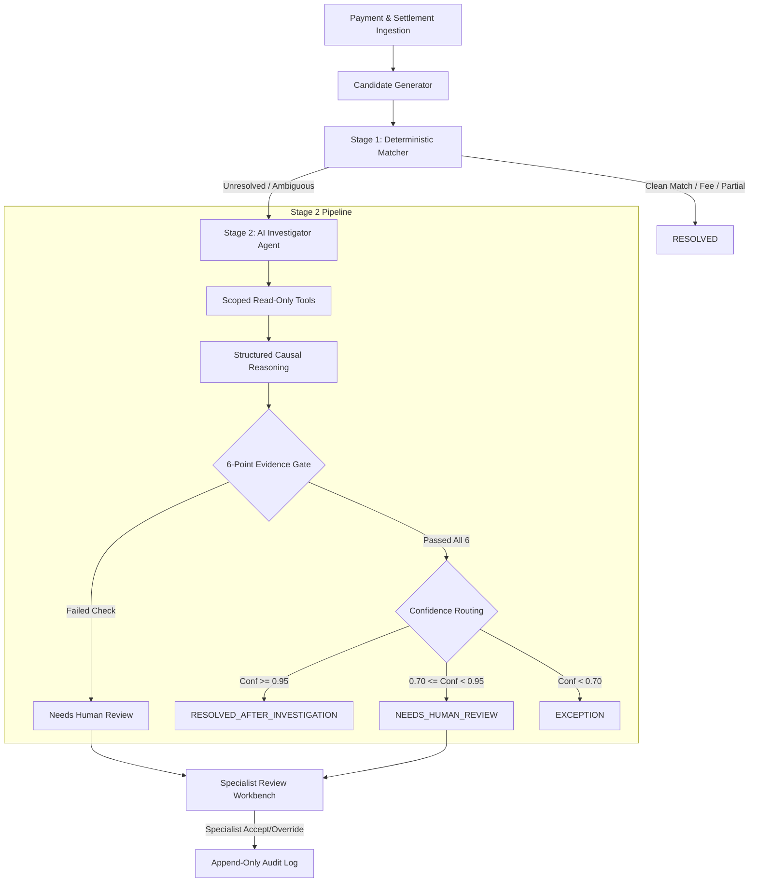

# AI Finance Controller — Architecture Specification (Track 04)

## 1. System Overview

The **AI Finance Controller** is an enterprise-grade reconciliation and exception investigation system designed to reconcile high-volume payment transactions against settlement batches, bank statements, and invoices.

The architecture strictly adheres to a **2-Stage Separation of Concerns**:
1. **Stage 1 (Deterministic In-Memory Rules)**: High-throughput matching resolving ~70-75% of clean transactions in sub-millisecond per-record time without calling any LLM.
2. **Stage 2 (AI Investigator & Evidence Gate)**: Agentic investigation on ambiguous or unlinked cases using read-only database tools, structured causal reasoning, a **6-point deterministic evidence gating checklist**, and calibrated confidence routing.

---

## 2. Core Components

### 2.1 Candidate Generator (`backend/reconciliation/candidate_generator.py`)
Surfaces plausible invoice, settlement, and refund candidate pairs for a payment:
- **Amount tolerance window**: ±5% (configurable)
- **Temporal tolerance window**: ±15 days
- **Counterparty fuzzy similarity**: SequenceMatcher ratio on normalized business names
- **Composite Proximity Scoring**: Weighted sum (Amount 45%, Date 35%, Counterparty 20%)

### 2.2 Stage 1 Matcher (`backend/reconciliation/matcher.py` & `rules.py`)
Evaluates 5 deterministic rules in strict priority order:
1. `Rule 1: check_exact_match` (1:1 Payment, Invoice, Settlement exact match)
2. `Rule 2: check_fee_deduction` (Gross = Invoice, Net = Gross - Fee - Tax within ₹0.50)
3. `Rule 3: check_refund_match` (Payment refund or chargeback reversal)
4. `Rule 4: check_many_to_one_sum` (Multiple payments covering a single aggregate invoice)
5. `Rule 5: check_partial_payment` (Split installment payment tracking)

Ambiguous cases (`name_mismatch`, `date_drift`, `chargeback`, `duplicate_transaction`, `missing_invoice`) are marked `UNMATCHED` and passed to Stage 2.

### 2.3 Stage 2 AI Investigator (`backend/agents/investigator.py`)
Coordinates scoped tool execution and structured evidence analysis:
- **Tools (`backend/agents/tools.py`)**: `get_payment`, `get_settlement`, `get_refunds`, `get_adjustments`, `get_invoice`, `search_related_transactions`, `get_customer` (with PII redaction), `list_evidence_by_ids`.
- **Reasoning**: Structured JSON schema output containing `verdict`, `reason`, `explanation`, `evidence_ids`, and `confidence`.

### 2.4 Evidence Validation Gate (`backend/agents/output_validator.py`)
No AI resolution commits to the ledger without passing all 6 independent deterministic checks:
1. **`EXISTENCE`**: Every cited evidence ID must exist in the database.
2. **`OWNERSHIP`**: Evidence records must belong to the payment or customer being investigated.
3. **`AMOUNT_MATH`**: Discrepancies between payment, settlement, and fees must verify mathematically.
4. **`TEMPORAL`**: Settlement and refund dates must fall within valid temporal horizons (≤45 days).
5. **`IDEMPOTENCE`**: Settlement records must not have been consumed by a prior reconciliation record.
6. **`CHECKSUM`**: Digital signatures / hashes must match payload state.

### 2.5 Confidence Routing (`backend/agents/output_validator.py`)
- `Confidence >= 0.95` AND `All 6 checks passed`: **`AUTO_RESOLVE`** (`RESOLVED_AFTER_INVESTIGATION`)
- `0.70 <= Confidence < 0.95` OR `Validation Failed`: **`HUMAN_REVIEW`** (`NEEDS_HUMAN_REVIEW`)
- `Confidence < 0.70`: **`EXCEPTION`** (`EXCEPTION`)

### 2.6 Human Review Workbench & Audit Service (`backend/services/`)
- Queue sorted by **Amount at Risk** (descending) and age (ascending).
- Dual-action workflow:
  - **`ACCEPT`**: Confirms AI proposed resolution.
  - **`OVERRIDE`**: Overrides verdict with mandatory specialist rationale and two-step confirmation.
- **`AuditService`**: Writes immutable, append-only logs (`AuditLog`) capturing actor, step, rationale, timestamps, and state snapshots.

---

## 3. Ground Truth Isolation Guarantee

To prevent data contamination and self-grading:
1. Ground truth records are stored in an isolated table (`ground_truth_records`).
2. Neither Stage 1 rules, Candidate Generator, nor Stage 2 Investigator agent ever query `ground_truth_records`.
3. The `Evaluator` (`backend/evaluation/evaluator.py`) reads `ground_truth_records` post-hoc only to calculate objective accuracy, precision, recall, confusion matrices, and Wilson 95% confidence intervals.
