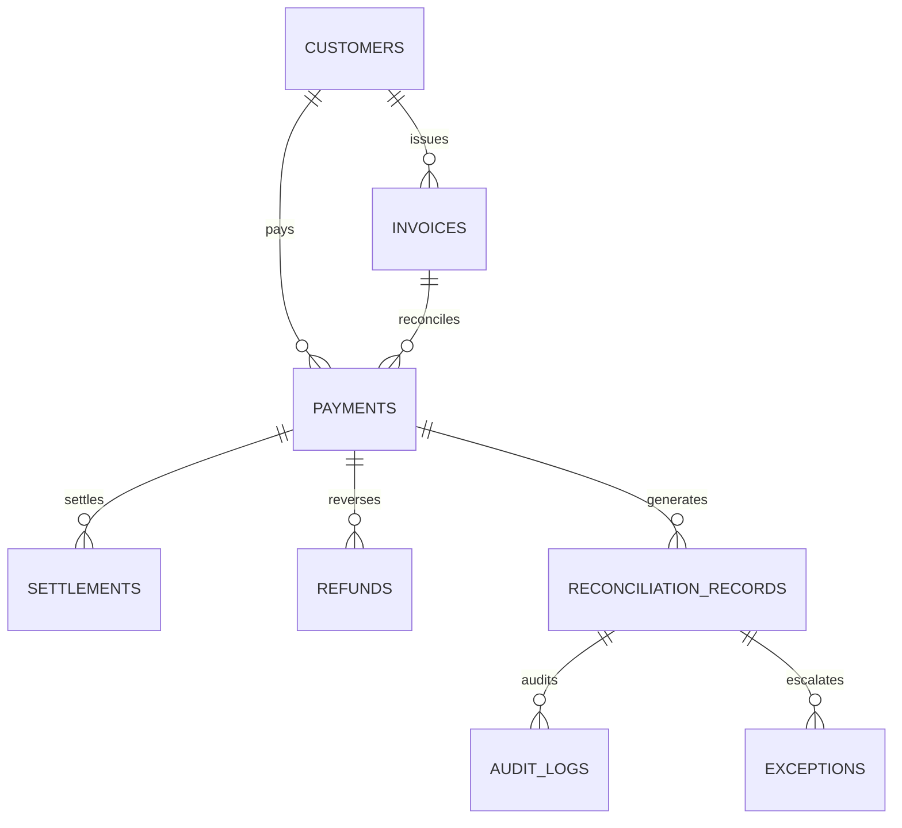

# AI Finance Controller — Data Model Specification

## 1. Relational Entity Overview

All database tables are mapped via SQLAlchemy ORM models in `backend/models/`. Every table inherits an immutable UUID primary key (`String(36)`), created/updated timestamps, and JSON metadata dictionaries.

---

## 2. Table Schemas

### 2.1 `payments` (`backend/models/payment.py`)
Stores inbound payment transactions captured across gateways:
- `id` (String(36), PK): UUID
- `razorpay_payment_id` (String(64), Unique): External gateway transaction identifier
- `invoice_id` (String(36), FK -> `invoices.id`, Nullable)
- `customer_id` (String(36), FK -> `customers.id`, Nullable)
- `amount` (Numeric(15, 2)): Gross payment amount
- `currency` (String(3)): e.g. "INR"
- `status` (String(32)): `captured`, `authorized`, `refunded`, `failed`
- `method` (String(32)): `card`, `upi`, `netbanking`, `bank_transfer`
- `fee` / `tax` (Numeric(15, 2)): Gateway fee and GST components
- `payer_name` / `payer_email` (String(255)): Redacted in AI tool responses
- `payment_date` (DateTime): Timestamp of payment execution
- `scenario_type` (String(64)): Synthetic scenario identifier for benchmarking

### 2.2 `settlements` (`backend/models/settlement.py`)
Stores nodal / bank settlement batches received from acquiring banks:
- `id` (String(36), PK): UUID
- `razorpay_settlement_id` (String(64), Unique): Settlement batch identifier
- `payment_id` (String(36), FK -> `payments.id`, Nullable)
- `gross_amount` (Numeric(15, 2)): Total transaction amount
- `fee` / `tax` (Numeric(15, 2)): Acquirer fees and statutory taxes
- `net_amount` (Numeric(15, 2)): Gross - Fee - Tax deposited into merchant account
- `utr` (String(64)): Unique Transaction Reference provided by bank
- `settlement_date` (Date): Value date of bank credit

### 2.3 `invoices` (`backend/models/invoice.py`)
Stores merchant billing obligations:
- `id` (String(36), PK): UUID
- `invoice_number` (String(64), Unique): e.g. `INV-2025-00122`
- `customer_id` (String(36), FK -> `customers.id`)
- `amount` (Numeric(15, 2)): Total billed receivable
- `status` (String(32)): `paid`, `open`, `overdue`, `cancelled`
- `issue_date` / `due_date` (Date)

### 2.4 `reconciliation_records` (`backend/models/reconciliation.py`)
Core ledger storing reconciliation verdicts:
- `id` (String(36), PK): UUID
- `payment_id` (String(36), FK -> `payments.id`, Nullable)
- `invoice_id` (String(36), FK -> `invoices.id`, Nullable)
- `settlement_id` (String(36), FK -> `settlements.id`, Nullable)
- `match_status` (String(64)): `MATCHED`, `PARTIALLY_MATCHED`, `RESOLVED_AFTER_INVESTIGATION`, `NEEDS_HUMAN_REVIEW`, `EXCEPTION`, `UNMATCHED`
- `match_score` (Float): Confidence score (0.00 to 1.00)
- `match_method` (String(64)): `rule_exact_1to1`, `rule_fee_deduction`, `rule_refund_matched`, `rule_many_to_one_sum`, `rule_partial_payment`, `AI_INVESTIGATION`, `HUMAN_OVERRIDE`
- `stage` (Integer): `1` (Deterministic) or `2` (AI Investigation)
- `discrepancy` (Numeric(15, 2)): Outstanding balance or variance
- `notes` (Text): Structured explanation and citations

### 2.5 `audit_logs` (`backend/models/audit.py`)
Append-only tamper-evident audit ledger:
- `id` (String(36), PK): UUID
- `entity_type` (String(64)): `reconciliation_record`, `payment`
- `entity_id` (String(36)): ID of reconciled entity
- `action` (String(64)): `CANDIDATE_GEN`, `DETERMINISTIC_CHECK`, `AI_INVESTIGATION`, `EVIDENCE_VALIDATION`, `CONFIDENCE_ROUTING`, `HUMAN_REVIEW`
- `actor` (String(64)): e.g. `system:stage1`, `ai_agent:investigator`, `specialist-ops`
- `previous_state` / `new_state` (JSON): State transition payloads
- `rationale` (Text): Mandatory rationale for overrides
- `timestamp` (DateTime): Immutable ISO-8601 UTC timestamp

### 2.6 `ground_truth_records` (`backend/models/ground_truth.py`)
Isolated evaluation oracle:
- `id` (String(36), PK): UUID
- `payment_id`, `invoice_id`, `settlement_id`, `refund_id`
- `scenario_type` (String(64)): 1 of 14 PRD scenario types
- `expected_verdict` (String(64)): e.g. `MATCHED`, `RESOLVED_AFTER_INVESTIGATION`, `EXCEPTION`
- `expected_stage` (Integer): `1` or `2`
- `explanation` (Text): Golden justification
